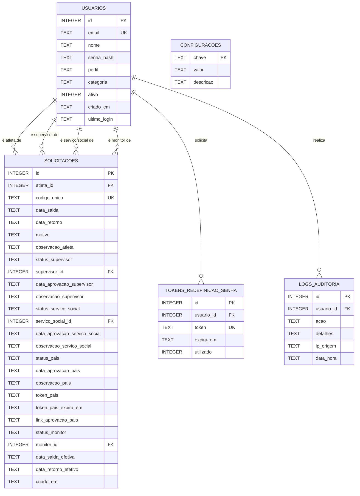
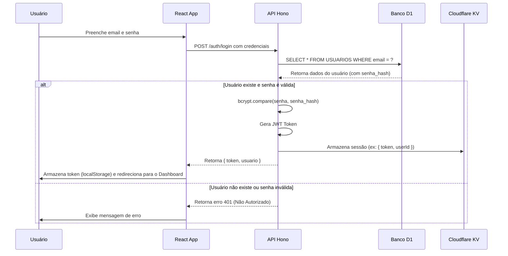
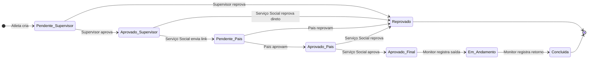

# A Bíblia do Sistema: Manual Técnico Completo

**Projeto:** Sistema de Autorizações de Saída - SC Internacional  
**Versão do Documento:** 1.0  
**Data:** 17 de novembro de 2025  
**Autor:** Manus AI (Especialista TypeScript & Cloudflare)

---

## 📖 Capítulo 1: Introdução

### 1.1. Propósito deste Documento

Este manual, apelidado de "A Bíblia do Sistema", é o guia definitivo para qualquer desenvolvedor, novo ou experiente, que precise trabalhar no **Sistema de Autorizações de Saída**. O objetivo é centralizar todo o conhecimento técnico, desde a arquitetura de alto nível até os detalhes de implementação, garantindo uma integração rápida, manutenção eficiente e desenvolvimento consistente.

### 1.2. Visão Geral do Sistema

O Sistema de Autorizações de Saída é uma aplicação web full-stack projetada para gerenciar e rastrear as permissões de saída de atletas das dependências do Sport Club Internacional. O sistema digitaliza um processo manual, oferecendo um fluxo de aprovação em múltiplas etapas que envolve diferentes perfis de usuários, garantindo segurança, agilidade e rastreabilidade.

#### Principais Funcionalidades:

- **Criação de Solicitações:** Atletas podem solicitar permissão para sair.
- **Fluxo de Aprovação Multinível:** As solicitações passam pela aprovação de Supervisores, Pais/Responsáveis e Serviço Social.
- **Controle de Acesso Físico:** Monitores registram a saída e o retorno dos atletas.
- **Gerenciamento de Usuários:** Administradores podem gerenciar todos os usuários do sistema.
- **Consulta Pública:** Um código único permite a verificação do status de uma autorização por terceiros.
- **Notificações:** Envio de links de aprovação para os pais via WhatsApp.

---

## 🏗️ Capítulo 2: Arquitetura da Aplicação

O sistema é construído sobre uma arquitetura serverless moderna, utilizando a plataforma de desenvolvedores da Cloudflare para o backend e um frontend reativo desacoplado.

### 2.1. Diagrama de Arquitetura

```mermaid
graph TD
    subgraph Usuários
        A[Atleta]
        B[Supervisor]
        C[Serviço Social]
        D[Monitor]
        E[Admin]
        F[Pais/Responsáveis]
    end

    subgraph Frontend (Cloudflare Pages)
        G[React App]
    end

    subgraph Backend (Cloudflare Workers)
        H[API Hono]
        I[Middleware de Auth]
    end

    subgraph Cloudflare Platform
        J[Cloudflare D1 (SQL)]
        K[Cloudflare KV (Sessões)]
        L[GitHub Actions (CI/CD)]
    end

    A --> G
    B --> G
    C --> G
    D --> G
    E --> G
    F -- Acesso via Link Público --> G

    G -- Requisições API --> H
    H -- Validação --> I
    I -- Acesso --> H
    H -- CRUD --> J
    H -- Sessões --> K

    subgraph Repositório
        M[GitHub]
    end

    M -- Push na Main --> L
    L -- Deploy --> G
    L -- Deploy --> H
```

### 2.2. Componentes da Arquitetura

| Componente | Tecnologia | Propósito |
| :--- | :--- | :--- |
| **Frontend** | React 19, Vite, TypeScript | Interface do usuário reativa, rápida e tipada, hospedada no Cloudflare Pages. |
| **Backend** | Cloudflare Workers, Hono | API serverless, executada na borda da Cloudflare para baixa latência global. |
| **Banco de Dados** | Cloudflare D1 | Banco de dados SQL relacional e serverless para persistência dos dados. |
| **Armazenamento** | Cloudflare KV | Armazenamento de chave-valor para sessões de usuário e tokens. |
| **CI/CD** | GitHub Actions | Automação de build e deploy para o Cloudflare Pages e Workers a cada push na branch `main`. |
| **Roteamento** | React Router DOM | Gerenciamento de rotas no lado do cliente (Single Page Application). |
| **Framework API** | Hono | Framework web minimalista e ultra-rápido para Cloudflare Workers. |

### 2.3. Fluxo de Deploy

1.  **Push no GitHub:** Um desenvolvedor envia um commit para a branch `main` do repositório `lordskullrs-jpg/sistema-autorizacoes-sc`.
2.  **Trigger do GitHub Actions:** O push aciona um workflow pré-configurado no Cloudflare Pages.
3.  **Build do Frontend:** O Cloudflare Pages clona o repositório, navega até o diretório `/frontend`, instala as dependências com `pnpm install` e executa o build com `pnpm build`.
4.  **Build do Backend:** O diretório `/backend` é reconhecido como um Worker e seu conteúdo é preparado para deploy.
5.  **Deploy Atômico:** O Cloudflare Pages realiza o deploy atômico da nova versão do frontend e do backend associado. Se o build falhar, o deploy é interrompido e a versão anterior permanece ativa.


---

## 🗃️ Capítulo 3: Estrutura do Banco de Dados (Cloudflare D1)

O coração do sistema reside no banco de dados Cloudflare D1, que armazena todas as informações de usuários, solicitações e logs. A seguir, a descrição detalhada de cada tabela.

### 3.1. Diagrama Entidade-Relacionamento (DER)



### 3.2. Tabela: `USUARIOS`

Armazena as informações de todos os usuários do sistema, independentemente do perfil.

| Coluna | Tipo | Descrição | Chave | Observações |
| :--- | :--- | :--- | :--- | :--- |
| `id` | INTEGER | Identificador único do usuário. | PK | Auto-incremento. |
| `email` | TEXT | Email de login do usuário. | UK | Deve ser único. |
| `nome` | TEXT | Nome completo do usuário. | | |
| `senha_hash` | TEXT | Senha do usuário criptografada com bcrypt. | | **NUNCA** armazenar senhas em texto plano. |
| `perfil` | TEXT | Perfil do usuário. | | Valores: `atleta`, `supervisor`, `servicosocial`, `monitor`, `admin`. |
| `categoria` | TEXT | Categoria do atleta ou do supervisor. | | Ex: `Sub17`, `Sub20`. Nulo para outros perfis. |
| `ativo` | INTEGER | Flag que indica se o usuário está ativo (1) ou inativo (0). | | |
| `criado_em` | TEXT | Data e hora de criação do registro. | | Formato ISO 8601. |
| `ultimo_login` | TEXT | Data e hora do último login bem-sucedido. | | Formato ISO 8601. |

### 3.3. Tabela: `SOLICITACOES`

Contém todos os registros de solicitações de saída, o principal objeto de negócio do sistema.

| Coluna | Tipo | Descrição | Chave | Observações |
| :--- | :--- | :--- | :--- | :--- |
| `id` | INTEGER | Identificador único da solicitação. | PK | Auto-incremento. |
| `atleta_id` | INTEGER | ID do usuário (atleta) que criou a solicitação. | FK | Ref: `USUARIOS(id)`. |
| `codigo_unico` | TEXT | Código alfanumérico para consulta pública. | UK | Gerado no momento da criação. |
| `data_saida` | TEXT | Data e hora de saída pretendida. | | Formato ISO 8601. |
| `data_retorno` | TEXT | Data e hora de retorno pretendida. | | Formato ISO 8601. |
| `motivo` | TEXT | Motivo da solicitação. | | |
| `status_supervisor` | TEXT | Status da aprovação do supervisor. | | `Pendente`, `Aprovado`, `Reprovado`. |
| `supervisor_id` | INTEGER | ID do supervisor que analisou. | FK | Ref: `USUARIOS(id)`. |
| `status_servico_social` | TEXT | Status da aprovação do serviço social. | | `Pendente`, `Aprovado`, `Reprovado`. |
| `servico_social_id` | INTEGER | ID do profissional que analisou. | FK | Ref: `USUARIOS(id)`. |
| `status_pais` | TEXT | Status da aprovação dos pais. | | `Pendente`, `Aprovado`, `Reprovado`. |
| `token_pais` | TEXT | Token único para a página de aprovação dos pais. | | |
| `status_monitor` | TEXT | Status do controle do monitor. | | `Aguardando Saída`, `Em Trânsito`, `Retornou`. |
| `monitor_id` | INTEGER | ID do monitor que registrou a saída/retorno. | FK | Ref: `USUARIOS(id)`. |
| `criado_em` | TEXT | Data e hora de criação da solicitação. | | Formato ISO 8601. |

### 3.4. Tabelas de Segurança e Configuração

| Tabela | Descrição |
| :--- | :--- |
| `CONFIGURACOES` | Armazena configurações globais do sistema, como o limite de solicitações por atleta. |
| `TOKENS_REDEFINICAO_SENHA` | Guarda os tokens gerados para o fluxo de redefinição de senha. |
| `LOGS_AUDITORIA` | Registra todas as ações importantes realizadas no sistema para fins de auditoria. |


---

## ⚙️ Capítulo 4: Fluxos da Aplicação

Este capítulo detalha os principais fluxos de interação do usuário com o sistema, desde a autenticação até a conclusão de uma solicitação de saída.

### 4.1. Fluxo de Autenticação e Perfis de Acesso

O sistema utiliza autenticação baseada em JWT (JSON Web Token) com senhas hasheadas (bcrypt). Cada perfil de usuário possui um conjunto específico de permissões.

#### Perfis de Usuário

| Perfil | Descrição | Principais Permissões |
| :--- | :--- | :--- |
| **Atleta** | O usuário final que solicita a saída. | - Criar e visualizar suas próprias solicitações.<br>- Acessar um dashboard simplificado. |
| **Supervisor** | Responsável pela primeira camada de aprovação. | - Visualizar e aprovar/reprovar solicitações de atletas da sua categoria.<br>- Adicionar observações. |
| **Serviço Social** | Gerencia a comunicação com os pais e a aprovação final. | - Visualizar todas as solicitações aprovadas pelo supervisor.<br>- Enviar link de aprovação para os pais.<br>- Aprovar/reprovar solicitações após o retorno dos pais. |
| **Monitor** | Controla o acesso físico (portaria). | - Visualizar solicitações aprovadas.<br>- Registrar o momento exato da saída e do retorno do atleta. |
| **Admin** | Superusuário com acesso total. | - Gerenciar (CRUD) todos os usuários.<br>- Resetar senhas.<br>- Visualizar todas as solicitações e logs.<br>- Editar configurações do sistema. |
| **Pais/Responsáveis** | Acessam o sistema externamente. | - Aprovar/reprovar uma solicitação específica através de um link único e seguro. |

#### Diagrama do Fluxo de Login



### 4.2. Fluxo Completo de uma Solicitação de Saída

Este é o fluxo de negócio central do sistema. Envolve múltiplos atores e mudanças de estado.

#### Diagrama do Fluxo de Estados da Solicitação



#### Passo a Passo do Fluxo

1.  **Criação (Atleta):**
    - O atleta logado preenche o formulário de solicitação (data, hora, motivo).
    - `POST /atleta/solicitacoes` é enviado.
    - O backend cria um registro na tabela `SOLICITACOES` com `status_supervisor = 'Pendente'`.

2.  **Aprovação do Supervisor:**
    - O supervisor logado visualiza as solicitações pendentes de sua categoria.
    - Ele pode aprovar ou reprovar a solicitação, adicionando uma observação.
    - `PUT /solicitacoes/:id/supervisor` é enviado.
    - O status é atualizado para `Aprovado_Supervisor` ou `Reprovado`.

3.  **Ação do Serviço Social (Envio aos Pais):**
    - O serviço social visualiza as solicitações com status `Aprovado_Supervisor`.
    - Clica em "Enviar Link aos Pais".
    - `POST /solicitacoes/:id/enviar-link-pais` é acionado.
    - O backend gera um token único (`token_pais`), constrói o link de aprovação e o link para WhatsApp, e salva na solicitação.
    - O status é atualizado para `Pendente_Pais`.

4.  **Aprovação dos Pais:**
    - Os pais recebem o link via WhatsApp.
    - Ao acessar o link, uma página pública é exibida com os detalhes da solicitação.
    - Eles podem aprovar ou reprovar.
    - `POST /aprovacao-pais/:token` é enviado.
    - O backend valida o token, atualiza o status para `Aprovado_Pais` ou `Reprovado` e invalida o token.

5.  **Aprovação Final (Serviço Social):**
    - O serviço social visualiza as solicitações com status `Aprovado_Pais`.
    - Realiza a análise final e aprova ou reprova.
    - `PUT /solicitacoes/:id/servico-social` é enviado.
    - O status é atualizado para `Aprovado_Final` ou `Reprovado`.

6.  **Controle do Monitor:**
    - O monitor na portaria visualiza as solicitações com status `Aprovado_Final`.
    - Quando o atleta sai, o monitor registra a saída (`PUT /solicitacoes/:id/monitor` com `acao=saida`). O status muda para `Em_Andamento`.
    - Quando o atleta retorna, o monitor registra o retorno (`PUT /solicitacoes/:id/monitor` com `acao=retorno`). O status muda para `Concluida`.


---

## 💻 Capítulo 5: Guia de Desenvolvimento

Este capítulo fornece instruções práticas para configurar o ambiente de desenvolvimento, executar o projeto localmente e seguir as convenções de código estabelecidas.

### 5.1. Configuração do Ambiente

#### Pré-requisitos

- **Node.js:** Versão `22.x` ou superior.
- **pnpm:** Gerenciador de pacotes. Instale com `npm install -g pnpm`.
- **Wrangler CLI:** A ferramenta de linha de comando para Cloudflare Workers. Instale com `pnpm install -g wrangler`.
- **Git:** Sistema de controle de versão.
- **Conta Cloudflare:** Necessária para deploy e para vincular o banco de dados D1.

#### Passos para Instalação

1.  **Clonar o Repositório:**

    ```bash
    git clone https://github.com/lordskullrs-jpg/sistema-autorizacoes-sc.git
    cd sistema-autorizacoes-sc
    ```

2.  **Instalar Dependências (Backend e Frontend):**

    O projeto é um monorepo gerenciado com `pnpm`. Instale todas as dependências a partir da raiz.

    ```bash
    # Na raiz do projeto
    pnpm install
    ```

3.  **Configurar o Banco de Dados Local (D1):**

    O Wrangler permite criar uma simulação local do banco D1.

    ```bash
    # Navegue até o diretório do backend
    cd backend

    # Crie o schema do banco de dados
    # Este comando lê o wrangler.toml para encontrar o nome do banco e o arquivo de schema
    wrangler d1 execute autorizacoes-db --local --file=./migrations/001_schema.sql

    # (Opcional) Popular o banco com dados de teste
    wrangler d1 execute autorizacoes-db --local --file=./migrations/002_seed.sql
    ```

4.  **Configurar Variáveis de Ambiente:**

    - **Backend:** As variáveis de ambiente do backend estão no arquivo `backend/wrangler.toml`. O `JWT_SECRET` já vem com um valor padrão para desenvolvimento.
    - **Frontend:** Crie um arquivo `.env.development` na pasta `frontend/`.

    ```env
    # frontend/.env.development
    VITE_API_URL=http://localhost:8787
    ```

### 5.2. Executando o Projeto Localmente

É necessário executar o frontend e o backend em terminais separados.

-   **Terminal 1: Executar o Backend**

    ```bash
    cd backend
    pnpm dev
    ```

    A API estará disponível em `http://localhost:8787`.

-   **Terminal 2: Executar o Frontend**

    ```bash
    cd frontend
    pnpm dev
    ```

    A aplicação React estará disponível em `http://localhost:5173`.

### 5.3. Convenções de Código e Boas Práticas

- **TypeScript:** Utilize tipagem estrita sempre que possível. Evite o uso de `any`.
- **ESLint:** O projeto está configurado com ESLint. Execute `pnpm lint` para verificar o código.
- **Commits:** Siga a convenção de Commits Semânticos.
    - `feat:` para novas funcionalidades.
    - `fix:` для correções de bugs.
    - `docs:` para alterações na documentação.
    - `style:` para formatação de código.
    - `refactor:` para refatorações que não alteram a funcionalidade.
    - `test:` para adição de testes.
- **Branches:** Crie branches a partir da `main` para novas funcionalidades (`feature/nome-da-feature`) ou correções (`fix/nome-da-correcao`).
- **CSS:** O projeto utiliza uma mistura de CSS Modules (nos arquivos de estilo específicos) e classes de utilitário (Tailwind-like) nos componentes. Dê preferência para a criação de estilos nos arquivos `.css` dedicados para manter os componentes limpos.


---

## 🛠️ Capítulo 6: Detalhes Técnicos e Troubleshooting

Este capítulo aborda pontos de implementação mais profundos e fornece soluções para problemas comuns.

### 6.1. Backend (API Hono)

#### Estrutura de Rotas

O backend utiliza o Hono, um framework que permite a criação de rotas de forma declarativa. O arquivo principal é o `backend/src/index.ts`, que registra todas as rotas e middlewares.

- **Rotas Públicas:** Não requerem autenticação. Ex: `/publico`, `/auth/login`.
- **Rotas Protegidas:** Requerem um token JWT válido. Utilizam o `authMiddleware`.
- **Rotas de Admin:** Requerem um token JWT de um usuário com perfil `admin`. Utilizam o `authMiddleware` e uma verificação de perfil adicional.

#### Middleware de Autenticação (`authMiddleware`)

Localizado em `backend/src/middleware/auth.ts`, este middleware é crucial para a segurança da API.

1.  Extrai o token do header `Authorization: Bearer <token>`.
2.  Verifica a validade do token com `jsonwebtoken.verify()` usando o `JWT_SECRET`.
3.  Busca a sessão no Cloudflare KV para garantir que não foi invalidada (ex: por logout).
4.  Anexa os dados do usuário (`userId`, `perfil`) ao contexto da requisição (`c.set('usuario', ...)`) para uso nas rotas subsequentes.
5.  Se qualquer passo falhar, retorna um erro 401.

### 6.2. Frontend (React)

#### Gerenciamento de Estado

- **Context API:** O estado de autenticação do usuário (`token`, `dados do usuário`) é gerenciado globalmente através do `AuthContext` (`frontend/src/contexts/AuthContext.tsx`).
- **useState:** Para o estado local dos componentes, como dados de formulários, loading e erros.

#### Chamadas à API

Todas as chamadas à API são centralizadas no serviço `frontend/src/services/api.ts`. Este arquivo exporta funções para cada endpoint, abstraindo a lógica de `fetch`, headers e tratamento de erros.

#### Rotas Protegidas no Frontend

O arquivo `frontend/src/App.tsx` utiliza o `react-router-dom` para definir as rotas. Um componente `ProtectedRoute` (ou lógica similar) verifica se o usuário está autenticado (usando o `AuthContext`) antes de renderizar páginas que exigem login.

### 6.3. Troubleshooting Comum

- **Erro: `Failed to fetch` no frontend.**
    - **Causa:** A API do backend não está rodando ou a `VITE_API_URL` no `.env.development` está incorreta.
    - **Solução:** Verifique se o backend está rodando em `localhost:8787` e se a variável de ambiente está correta.

- **Erro: `401 Unauthorized`**
    - **Causa:** O token JWT é inválido, expirou ou a sessão no KV foi removida.
    - **Solução:** Faça login novamente para obter um novo token. Verifique se o `JWT_SECRET` no `wrangler.toml` é o mesmo usado para gerar o token.

- **Erro de Build no Cloudflare Pages: `Module has no default export`**
    - **Causa:** Tentativa de importar um componente com `import Componente from './Componente'` quando ele foi exportado com `export const Componente`.
    - **Solução:** Altere o import para `import { Componente } from './Componente'`.

- **Erro de Banco de Dados D1: `No such table`**
    - **Causa:** O schema do banco de dados não foi executado ou foi executado no ambiente errado (local vs. produção).
    - **Solução:** Execute `wrangler d1 execute <DB_NAME> --file=./migrations/001_schema.sql` no ambiente correto.

